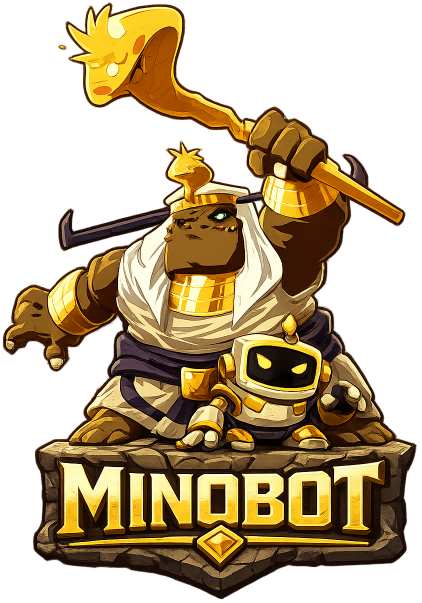
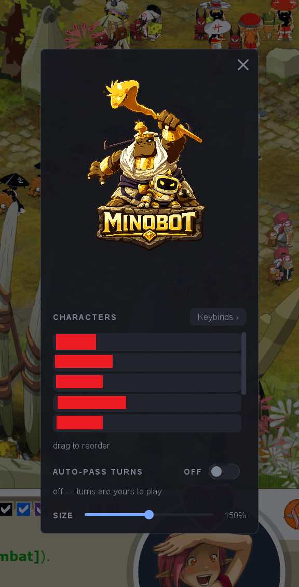
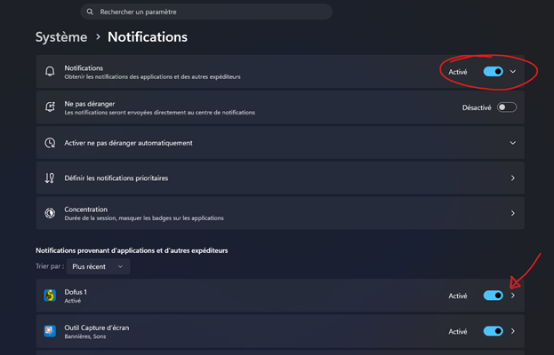
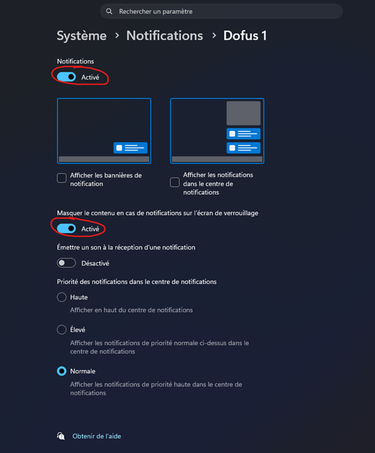

# Minobot

Minobot est un petit logiciel de confort pour **Dofus Retro**, destiné aux joueurs qui font tourner
plusieurs personnages en même temps.

Il ne triche pas et ne joue pas à votre place. Il reste discrètement en fond, à côté de l'horloge de
Windows, et attend que vous appuyiez sur une touche pour vous épargner les manipulations pénibles du
multi-compte : cliquer neuf fois la même chose dans neuf fenêtres, inviter tout le monde en groupe un
par un, chercher la bonne fenêtre dans la barre des tâches.

Un overlay est également disponible en jeu.

---

## Ce qu'il sait faire

### Cliquer dans toutes les fenêtres à la fois — touche `X1`

C'est la fonction principale. Vous placez votre souris quelque part dans le jeu, vous appuyez sur le
bouton latéral de votre souris (`X1`, celui sous le pouce), et **tous vos personnages cliquent au même
endroit que vous**. Pratique pour ramasser se déplacer, entrer dans un zaap ou valider une fenêtre
sur toute la team d'un coup.

Deux choses à savoir :

- **Votre personnage principal ne perd jamais le focus.** Vous continuez à jouer normalement pendant
  que les autres cliquent en arrière-plan.
- Windows a la mauvaise habitude de faire **clignoter en orange** les fenêtres en arrière-plan qui
  reçoivent un clic. Minobot fait de son mieux pour l'éviter, mais si des fenêtres clignotent quand
  même, appuyez sur **`Shift+X1`** : il passe sur chacune d'elles pour éteindre le clignotement.

### Inviter tout le monde en groupe — touche `F8`

Une seule touche et toute votre team se retrouve en groupe. Le personnage au premier plan devient le
chef : il invite le deuxième, qui accepte et invite le troisième, et ainsi de suite jusqu'au dernier.

Minobot attend la **notification du jeu** à chaque étape pour savoir que l'invitation est bien
arrivée, plutôt que d'enchaîner à l'aveugle. C'est ce qui le rend fiable même quand le jeu rame.

### Passer d'un personnage à l'autre — touches `X2` et `Shift+X2`

`X2` (l'autre bouton latéral de la souris) fait défiler vos personnages **dans l'ordre que vous avez
choisi**, et `Shift+X2` dans l'autre sens. Bien plus confortable qu'`Alt+Tab`, qui vous envoie
n'importe où.

Seules les fenêtres **de l'écran sur lequel vous êtes** participent au défilement. Si vous jouez sur
deux écrans, chacun garde son propre cycle.

### Ranger la barre des tâches — touche `F9`

Vos fenêtres de jeu se lancent dans le désordre dans la barre des tâches ? `F9` les remet dans l'ordre
que vous avez configuré.

> ⚠️ Pendant l'opération, **vos fenêtres disparaissent quelques instants** : c'est normal, c'est le
> seul moyen de forcer Windows à les réafficher dans le bon ordre. Elles reviennent toutes seules.

### Ramener le bon personnage à l'écran — automatique

Quand un de vos personnages en arrière-plan se fait attaquer, recevoir un message ou inviter, le jeu
affiche une notification Windows. Minobot la voit et **bascule automatiquement sur ce personnage**.

### Accepter les échanges entre vos comptes — interrupteur dans l'overlay

Ouvrez l'overlay (`Shift+Espace`) et activez **Auto-accept trades**. À partir de là, quand un de vos
personnages en propose un échange à un autre, **le receveur accepte tout seul** : un bref passage sur sa
fenêtre, l'échange est accepté (touche **Entrée**), et vous revenez aussitôt sur la fenêtre où vous
étiez. Fini les allers-retours pour faire transiter des ressources entre vos persos.

Minobot reconnaît que la demande vient d'**un de vos comptes** grâce au nom écrit dans la notification
(comparé **au nom exact** de vos personnages : un joueur nommé `SuperAlpha` n'est pas votre `Alpha`).
Si c'est un **autre joueur** qui vous propose un échange, rien n'est accepté à votre place : Minobot se
contente de **basculer sur la fenêtre concernée**, comme d'habitude, et vous décidez.

**Cette fonction est activée par défaut.** Vous pouvez la couper depuis l'overlay le temps de la session.

### Passer les tours automatiquement — interrupteur, raccourci et bandeau

En combat, le jeu affiche une notification quand c'est au tour d'un personnage de jouer. Activez
**Auto-pass turns** — depuis l'overlay (`Shift+Espace`), ou d'une pression sur le raccourci
**`Shift+clic molette`** (réattribuable dans le tiroir Keybinds) : à partir de là, dès qu'un personnage
reçoit cette notification, Minobot passe son tour tout seul (touche **F1** du jeu). Idéal quand vous
laissez une équipe de mules dans un combat pendant que vous jouez ailleurs.

Tant que la fonction tourne, un **bandeau** « Auto-pass turns enabled. » reste affiché en haut de la
fenêtre de jeu, pour que rien ne se passe à votre insu. Une **petite croix** le referme — mais **ça ne
coupe pas la fonction**, ça ne fait que cacher le bandeau (il réapparaît si vous ré-activez la fonction).
Pour l'arrêter, rebasculez l'interrupteur ou le raccourci.

L'interrupteur est **très explicite** — un gros ON/OFF sur le panneau — et il passe le tour de **tous**
les personnages, **y compris celui que vous avez à l'écran** : l'activer, c'est dire « je me suis levé
de la table ». Il est donc **éteint par défaut** et **s'oublie au redémarrage** (comme tous les réglages
faits dans l'overlay).

---

## Installation

1. Téléchargez le fichier `Minobot-x.y.z.zip` depuis la
   [page des versions](https://github.com/AdrienLeblanc/minobot/releases/latest), puis
   **décompressez le dossier où vous voulez** (sur le bureau, dans vos documents, peu importe).
2. Lancez **`Minobot.exe`**.
3. C'est tout. Il n'y a rien à installer, pas même Java : tout voyage dans le dossier.

**Important** : Minobot se basant sur le système de notifications Windows, il est **impératif** de les
   activer.
1. Aller dans les paramètres Windows et **activer les notifications**.

2. Si elles vous dérangent,  **vous pouvez les rendre silencieuses**, en cochant
   `Masquer le contenu...`
   
   Minobot fonctionnera tout pareil.

> **Au premier lancement, Windows peut afficher un écran bleu « Windows a protégé votre
> ordinateur ».** C'est normal : Minobot est un petit logiciel gratuit qui n'est pas encore connu de
> Windows, alors il se méfie par précaution — ça ne veut pas dire qu'il y a un problème. Cliquez sur
> **« Informations complémentaires »**, puis sur le bouton **« Exécuter quand même »** qui apparaît.
> Windows ne vous le redemandera plus.

Une **icône apparaît à côté de l'horloge**, en bas à droite de l'écran : c'est le signe que Minobot
tourne. Pour l'arrêter, faites un clic droit dessus et choisissez **Quitter**.

> Si vous ne voyez pas l'icône, cliquez sur la petite flèche `^` à côté de l'horloge : Windows a
> tendance à cacher les icônes récentes.

---

## L'overlay — votre tableau de bord (`Shift+Espace`)

Placez-vous sur une fenêtre de jeu et appuyez sur **`Shift+Espace`** : un panneau s'affiche par-dessus
le jeu, au centre, sur un fond assombri. **C'est là que vous réglez tout** — il n'y a aucun fichier à
ouvrir. Réappuyez sur `Shift+Espace`, ou cliquez sur la **croix** en haut du panneau, pour le refermer.

Deux choses à savoir :

- Le panneau **appartient à la fenêtre de jeu** : `Shift+Espace` sur le bureau ou dans un navigateur ne
  fait rien. Il suit la fenêtre si vous la déplacez.
- Tant qu'il est ouvert, **il occupe toute la surface du jeu** (vous ne pouvez pas jouer en même temps) :
  refermez-le pour reprendre la main. C'est un panneau de réglages, pas un mode de jeu.

Sur le panneau, de haut en bas :

### Vos personnages, dans l'ordre

Minobot **trouve tout seul vos fenêtres de jeu** et les affiche en liste. **Glissez-les pour les remettre
dans l'ordre que vous voulez** : c'est ce même ordre qui sert au défilement (`X2`) et au rangement de la
barre des tâches (`F9`). Vous n'avez rien à écrire nulle part.

### La classe et le sexe de chaque personnage

Cliquez sur **« pick class… »** en face d'un personnage : une grille des **douze classes** de Dofus
Retro s'ouvre, avec une bascule **homme / femme** en haut. Choisissez, et l'icône de la classe s'affiche
à côté du nom — de quoi repérer vos persos d'un coup d'œil.

### Connecté, déconnecté, et « oublier » un personnage

Chaque ligne porte une **pastille de statut** : verte quand la fenêtre du perso est ouverte, grise quand
elle ne l'est pas. Un personnage à qui vous avez attribué une classe ou un sexe **reste dans la liste
même déconnecté** (grisé), pour garder sa place dans l'ordre — pratique quand vous relancez un compte.
Une **petite croix** sur une ligne grisée le retire définitivement de la liste.

### Les deux interrupteurs

**Auto-accept trades** et **Auto-pass turns**, les deux fonctions décrites plus haut, s'allument et
s'éteignent ici d'un clic (un gros ON/OFF).

### La taille du panneau

Un **curseur** en bas agrandit ou réduit le panneau. Sur un grand écran, montez-le si le texte vous
paraît petit.

### Réattribuer les touches — le tiroir « Keybinds »

Le bouton **`Keybinds ›`** déplie un tiroir sur le côté, où figure **la touche de chaque fonction**. Pour
en changer une, cliquez dessus puis **appuyez simplement sur la nouvelle touche** — Minobot la capture,
vous n'avez rien à taper.

Quelques touches ne conviennent pas :

- **Les lettres et les chiffres ne marchent pas** (`A`, `1`, `Ctrl+S`…). C'est volontaire : ce sont les
  touches du chat du jeu, un raccourci posé dessus se déclencherait au milieu de vos phrases. Utilisez
  plutôt les **touches de fonction `F1`–`F12`**, la **barre d'espace**, les **boutons latéraux de la
  souris** (`X1`/`X2`, sous le pouce), éventuellement avec `Ctrl`, `Shift` ou `Alt`.
- Vous pouvez aussi poser une fonction sur le **clic gauche, droit ou molette**, mais elle se déclenchera
  alors à *chacun* de ces clics, partout — ça n'a de sens que pour le clic multiple.
- **La combinaison la plus précise gagne** : si `X2` et `Shift+X2` servent tous les deux, `X2` maintenu
  avec Shift ne déclenche que le second, jamais les deux à la fois.

> Ce que vous réglez dans l'overlay est **retenu d'une fois sur l'autre** : l'ordre des personnages,
> leurs classes, vos touches. Seuls la taille du panneau et les deux interrupteurs repartent de zéro à
> chaque redémarrage.

---

## Réglages avancés (`config.json`) — facultatif

Tout ce qui précède se règle dans l'overlay. Il subsiste un fichier **`config.json`**, créé à côté de
`Minobot.exe` au premier lancement, pour quelques options que l'overlay ne couvre pas. Ouvrez-le avec le
Bloc-notes ; **après une modification, quittez Minobot et relancez-le** pour qu'il en tienne compte.

| Réglage | À quoi ça sert |
| --- | --- |
| `multiclick_exclude` | Les personnages à **laisser en dehors** du clic multiple. Exemple : `["Mule", "Marchand"]` — votre marchand ne bougera pas quand les autres cliquent. |
| `auto_accept_trade` / `auto_pass_turn` | L'état de départ des deux interrupteurs (`true`/`false`). L'overlay les bascule le temps de la session ; ici vous fixez leur position au démarrage. `auto_accept_trade` vaut `true` par défaut, `auto_pass_turn` vaut `false`. |
| `log_level` | Mettez `"DEBUG"` à la place de `"INFO"` si vous devez signaler un problème : Minobot écrira beaucoup plus de détails dans son journal. |

Une ligne que vous supprimez du fichier reprend simplement sa valeur d'origine.

---

## En cas de problème

Minobot tient un journal de tout ce qu'il fait dans le fichier **`logs/minobot.log`**, à côté de
`Minobot.exe`. C'est le premier endroit à regarder, et c'est le fichier à joindre si vous signalez un
souci.

| Symptôme | Ce qu'il faut vérifier |
| --- | --- |
| Rien ne se passe quand j'appuie sur une touche | Minobot tourne-t-il ? Cherchez l'icône à côté de l'horloge. Les réglages faits dans l'overlay s'appliquent tout de suite ; en revanche, si vous avez touché à `config.json`, il faut **relancer** le logiciel. |
| Une seule fonction ne répond plus | La touche que vous lui avez donnée n'est peut-être pas reconnue. Rouvrez le tiroir **Keybinds** de l'overlay pour la réattribuer. Dans `logs/minobot.log`, une ligne `Hotkey main key ... is not supported.` le confirme : les autres fonctions continuent de tourner, seule celle-là est coupée. |
| Les fenêtres clignotent en orange | Appuyez sur `Shift+X1`. |
| Le défilement `X2` saute des personnages | Ouvrez l'overlay pour vérifier l'ordre de vos personnages, et souvenez-vous que seules les fenêtres **de l'écran courant** défilent. |
| Le fichier `config.json` semble ignoré | Il doit être **à côté de `Minobot.exe`**, et rester un fichier valide : une virgule oubliée suffit à le casser. Dans ce cas Minobot repart sur ses réglages d'origine et le note dans son journal. |
